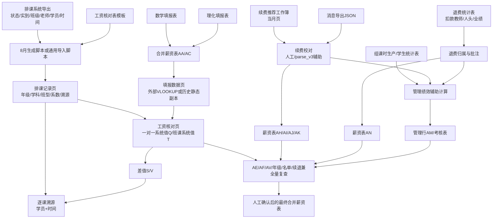

# 当前工资数据流

## 文本版流程

`排课系统导出`
→ 过滤有效且实到大于 0 的行
→ 提取年级/学科/班型，写入 `排课记录`
→ 用 Excel 公式计算一对一、班课系统值
→ 从数学/理化填报表取得 AA/AC，形成 R/U 和 S/V
→ 用学员/时间逐课定位差额
→ 单独校对 AE/AF、星级和批注
→ 解析续费消息并与续费工作簿交叉核对，填写 AH/AI/AJ/AK
→ 按退费表扣款教师归属，填写 AN 和批注
→ 按当月确认单价处理兼职
→ 从组课时生产、续费、退费和管理考核表形成管理岗位 AM
→ 按名单、年级、公式、差值、续退兼和管理行逐项复查
→ 人工确认并形成最终合并薪资表。

## 边界

- Python 不负责整条流程编排。
- Excel 公式是实际汇总和工资计算的一部分。
- 消息解析脚本输出中间 JSON，不直接进入最终工资表。
- 退费特殊情况、代课折算、兼职单价、星级覆盖和最终通过仍由人工决定。

